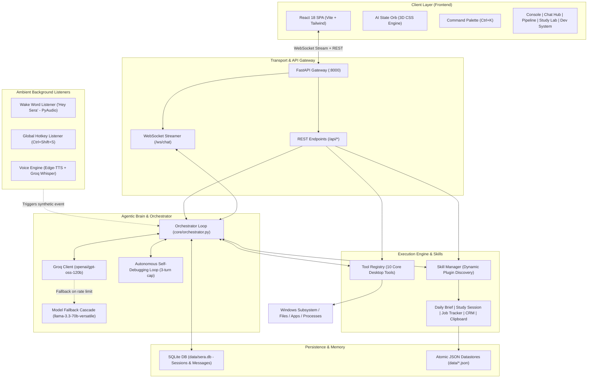
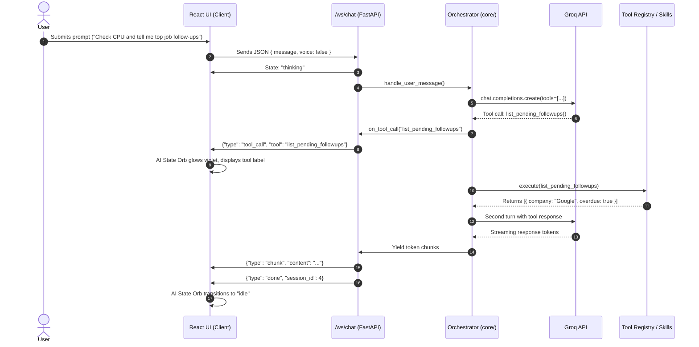

# SERA AI — System Architecture & Technical Blueprint

> **SERA** (*Synthetically Engineered Responsive Assistant*) is a modular, low-latency, desktop AI companion, agentic orchestrator, and developer cockpit tailored for software engineering, academic revision, business pipeline management, and PC automation.

---

## 1. High-Level Architectural Diagram



---

## 2. Core Architectural Layers

### 2.1 Layer 1: Client Experience Layer (React 18 SPA)
Located at `frontend/src/`, built with **React 18**, **Tailwind CSS**, and **Vite**, compiling directly into `interfaces/web/`:
- **`AppContext.jsx`**: Centralized single source of truth managing:
  - Real-time bidirectional WebSocket connection to `/ws/chat`.
  - The **AI State Machine** (`idle` ➔ `listening` ➔ `thinking` ➔ `speaking`).
  - Rolling 15-sample telemetry history for 60-second hardware sparklines.
  - Toast notification queue with accessible ARIA live announcements.
- **`AiStateOrb.jsx`**: Physical 3D CSS lighting moment functioning as the visual heartbeat of the agentic orchestrator.
- **Views**:
  1. **Console**: Daily morning orientation brief, in-place study stopwatch, 3D radial hardware dials, pending job follow-ups, and CRM deals accordion.
  2. **Chat Hub**: Hero AI state orb, Markdown stream renderer with syntax highlighting, live tool calling indicator, voice recording dock.
  3. **Pipeline**: 5-stage Job Application Funnel and 5-stage Client CRM Kanban board with inline stage transitions.
  4. **Study Lab**: RGPV Exam revision sessions with live stopwatch and 7-day progress breakdown.
  5. **Dev & System**: Multi-template code scaffolder, dynamic skill manager toggles, and clipboard capture audit logs.
- **`CommandPalette.jsx`**: Global `Ctrl+K` keyboard overlay supporting instant view switching, study block triggers, and settings toggling.

---

### 2.2 Layer 2: Transport & API Gateway (`interfaces/web_server.py`)
Powered by **FastAPI** and **Uvicorn**:
- **Bidirectional WebSocket (`/ws/chat`)**:
  - Handles streaming token exchange between client and backend.
  - Broadcasts live agentic state updates (`{"type": "state", "state": "thinking"}`).
  - Emits real-time tool execution events (`{"type": "tool_call", "tool": "search_file"}`).
  - Streams LLM markdown chunks (`{"type": "chunk", "content": "..."}`).
- **REST Endpoints (`/api/*`)**:
  - System Telemetry: `/api/system-info` (CPU, RAM, Disk, Battery via `psutil`).
  - Skills & Controls: `/api/skills`, `/api/skills/toggle`, `/api/scaffold`.
  - CRM & Leads: `/api/leads`, `/api/leads/status`.
  - Jobs & Internships: `/api/jobs`, `/api/jobs/stage`, `/api/jobs/stats`, `/api/jobs/followups`.
  - Study Sessions: `/api/study/start`, `/api/study/end`, `/api/study/status`, `/api/study/stats`.
  - Clipboard & Read Later: `/api/captures`, `/api/read-later`, `/api/clipboard/toggle`.
  - Voice Services: `/api/voice/toggle`, `/api/voice/listen`, `/api/wake/toggle`.

---

### 2.3 Layer 3: Agentic Brain & Orchestrator (`core/orchestrator.py`)
The autonomous cognitive hub of SERA:
- **Groq LLM Client**:
  - Primary model: `openai/gpt-oss-120b` (low-latency, 120B parameter reasoning).
  - Multi-tier Fallback Cascade: Automatically degrades to `llama-3.3-70b-versatile` or `mixtral-8x7b-32768` on rate limits or API outages without dropping the conversation turn.
- **Dynamic Tool-Calling Loop**:
  - Inspects LLM completions for function calling signatures.
  - Emits pre-execution callbacks (`on_tool_call`) to notify frontend observers.
  - Executes tools via `ToolRegistry` and appends synthetic tool results to context.
  - Iterates up to 5 turns autonomously until a final user-facing response is produced.
- **Autonomous Self-Debugging Engine**:
  - When code execution fails in `execute_python_code`, SERA inspects the stack trace.
  - Invokes `edit_file` to patch the syntax or logic error and automatically re-executes.
  - Protected by a strict 3-attempt circuit breaker to prevent infinite loops.

---

### 2.4 Layer 4: Extensible Skill Subsystem (`skills/`)
SERA implements an open plugin architecture extending `BaseSkill` (`skills/base_skill.py`):
```python
class BaseSkill(ABC):
    @abstractmethod
    def get_tools(self) -> List[BaseTool]: ...
    def get_system_prompt_addition(self) -> Optional[str]: ...
    def on_load(self) -> None: ...
    def on_unload(self) -> None: ...
```

#### Loaded Skill Modules:
1. **`notes_skill.py`**: Quick notes manager with search, tagging, and active study session tag auto-injection (`data/notes.json`).
2. **`crm_skill.py`**: Freelance client and deal pipeline manager with contact tracking and stage movement (`data/leads.json`).
3. **`daily_brief_skill.py`**: Morning orientation compiler uniting pending follow-ups, overdue leads, recent coding recap, and hardware health.
4. **`study_session_skill.py`**: RGPV exam preparation manager tracking active study blocks, automatic duration calculation, and self-quizzing (`data/study_sessions.json`).
5. **`job_tracker_skill.py`**: Internship and job application pipeline with 14-day follow-up heuristic reminders (`data/job_applications.json`).
6. **`clipboard_capture_skill.py`**: Global hotkey classifier classifying text as `code`, `link`, `task`, or `note` and filing automatically (`data/captures.json`, `data/read_later.json`).

---

### 2.5 Layer 5: Persistent Storage & Memory Layer
- **SQLite Database (`data/sera.db`)**:
  - Managed by `memory/memory_store.py`.
  - Schema:
    - `sessions`: `(id INTEGER PRIMARY KEY, title TEXT, created_at TIMESTAMP)`
    - `messages`: `(id INTEGER PRIMARY KEY, session_id INTEGER, role TEXT, content TEXT, timestamp TIMESTAMP)`
- **Atomic JSON Datastores (`data/*.json`)**:
  - Uses atomic write-replace pattern (writes to temporary file first, then replaces atomically) preventing data corruption during power loss or abrupt exit.

---

### 2.6 Layer 6: Ambient Background Listener Layer
- **Hands-Free Wake Word (`voice/wake_word.py`)**:
  - Background daemon thread listening on microphone input via PyAudio/sounddevice.
  - Triggers on "Hey Sera", synthesizes an activation chime, and switches orchestrator to voice input.
- **Global Clipboard Hotkey Daemon (`core/clipboard_listener.py`)**:
  - Hooks system-wide `Ctrl+Shift+S` using non-blocking Windows keyboard hooks.
  - Implements a 2-second debounce timer to prevent duplicate captures.
  - Captures text from clipboard and dispatches it directly to the agentic classification engine.
- **Neural Voice Engine (`voice/voice_handler.py`)**:
  - STT: Groq Whisper Large v3 Turbo (`whisper-large-v3-turbo`) for near-instant transcription.
  - TTS: Microsoft Edge Neural TTS (`edge-tts`, voice `en-US-AriaNeural`).

---

## 3. Data Flow & Execution Sequences

### 3.1 Streaming Agentic Turn with Tool Invocation


---

## 4. Finite State Machine: AI State Orb

The visual heartbeat of the interface follows a strict 4-state reactive model:

```text
                  ┌──────────────┐
                  │     IDLE     │
                  │ (Calm Blue)  │
                  └──────┬───────┘
                         │
           User speaks   │  User sends text
        ┌────────────────┼────────────────┐
        ▼                                 ▼
┌───────────────┐                 ┌───────────────┐
│   LISTENING   │                 │   THINKING    │
│ (Green Pulse) │                 │(Violet Sheen) │
└───────┬───────┘                 └───────┬───────┘
        │                                 │
        │ Speech transcribed              │ Tool calls & LLM tokens
        └────────────────►┌───────────────┤
                          │               ▼
                          │        ┌───────────────┐
                          │        │   SPEAKING    │
                          │        │ (Amber Wave)  │
                          │        └───────┬───────┘
                          │                │
                          │ Playback done  │ Generation finished
                          └───────►┌───────┘
                                   │
                                   ▼
                            [Return to IDLE]
```

---

## 5. Security, Sandboxing & Reliability Guardrails

1. **Subprocess Code Runner Caps**:
   - `execute_code` enforces a hard **30-second timeout** to protect against runaway processes.
   - Code execution is sandboxed from blocking the server event loop using `asyncio.to_thread`.
2. **System File Protection**:
   - Dangerous system deletions (`C:\Windows`, system registry, `.env` file deletions) are strictly forbidden in file automation tools.
3. **Atomic File Writes**:
   - All state JSON files (`leads.json`, `notes.json`, `study_sessions.json`, `job_applications.json`, `captures.json`) are written via temporary files followed by atomic `os.replace` to prevent corrupted JSON states on crashes.
4. **Resilient Network Degradation**:
   - If the WebSocket drops, the React frontend automatically retries every 3.5 seconds and seamlessly falls back to HTTP REST for conversation turns.
